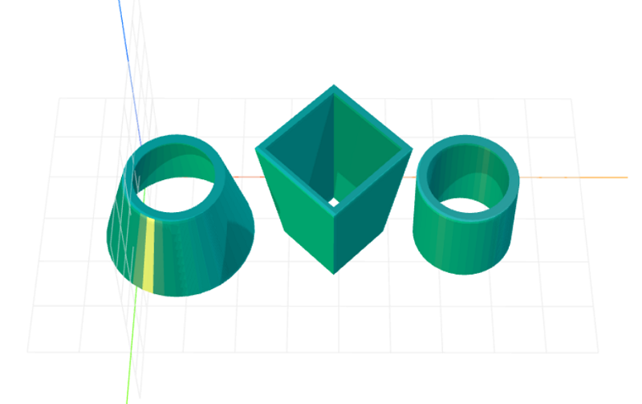

# craft-tube
Tube primitive for CraftML

### Install
    $ npm install craft-tube

### Parameters
- baseRadius: adjusts base radius of tube
- topRadius: adjusts top radius of tube
- height: adjusts height of tube
- thickness: adjusts thickness of tube sides
- sides: adjusts number of tube sides

### Example
```html
<<craft>
    <craft name="tube" module="craft-tube"/>
    <row spacing="1">
        <tube baseRadius="15" topRadius="10" height="20"></tube>
        <tube baseRadius="10" topRadius="15" height="30" sides="4"></tube>
        <tube></tube>
    </row>
</craft>
```

